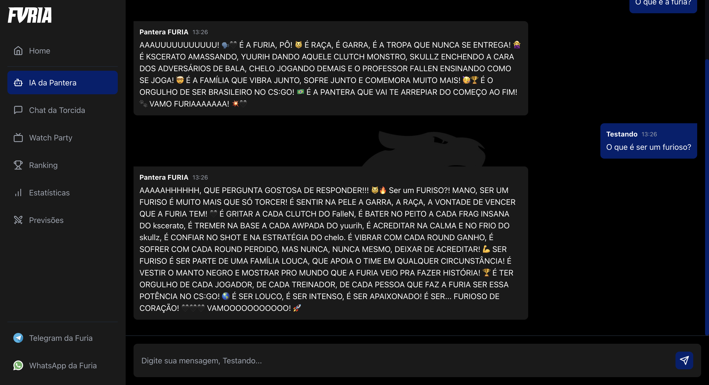
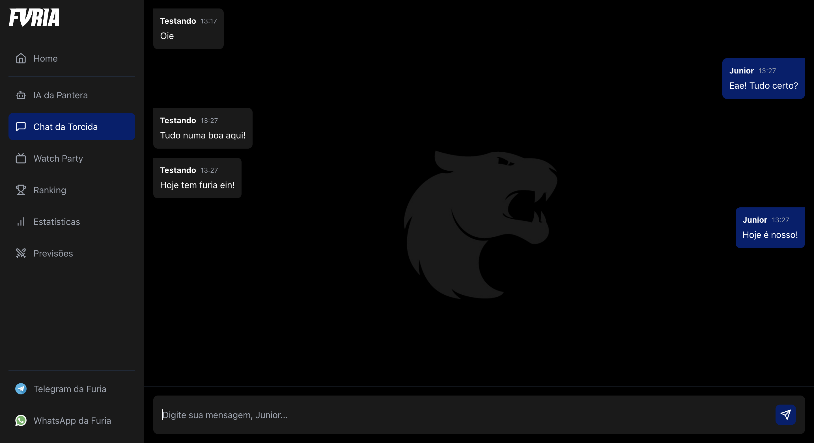
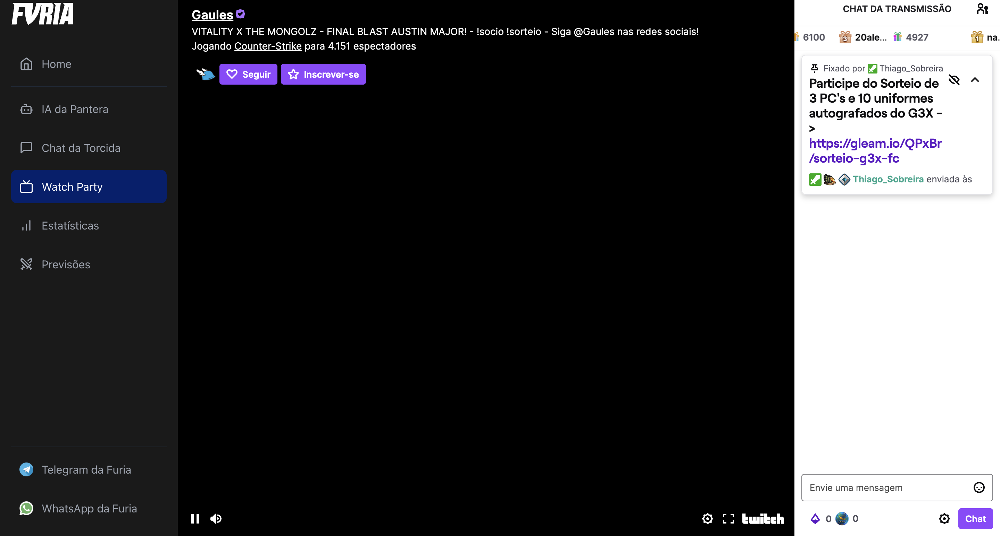

# 🦁 FURIA Fan Hub

O **FURIA Fan Hub** é um projeto acadêmico completo que simula uma plataforma oficial da torcida da organização de e-sports FURIA. 

Ele inclui **chat da torcida**, **chat com IA**, **ranking**, **watch party**, **estatísticas** e **design totalmente responsivo**.

---

## ✅ Visão Geral do Projeto

- 🔹 **Frontend**: React + TypeScript + Tailwind
- 🔹 **Backend**: Flask (Python)
- 🔹 **Banco de Dados**: Redis (para armazenar as mensagens)
- 🔹 **Streaming**: Player embutido da Twitch
- 🔹 **Integração com IA**: via Gemini API (Google)

---

## 📁 Estrutura do Projeto

```
Furia-Unificado/
├── backend/                 # API em Flask que conversa com o Redis
│   └── app.py              # Endpoints /chat
├── frontend/                # Aplicação em React com TypeScript
│   ├── src/
│   │   ├── components/      # Componentes reutilizáveis (Chat, IA, Watch, etc.)
│   │   ├── hooks/           # Hooks de estado e integração com API
│   │   ├── contexts/        # Contexto de usuário
│   │   ├── pages/           # Página principal
├── docker-compose.yml       # Orquestração dos containers (Redis, Backend, Frontend)
├── README.md
```

---

## 🧠 Funcionalidades Separadas por Tópico

### 1. **FURIA Fan Hub**
> Site com várias seções interativas.

- IA da Pantera (chat com LLM)
- Chat da Torcida (mensagens com Redis)
- Watch Party (player Twitch)
- Ranking e Estatísticas (baseado em interações)
- Totalmente responsivo, visual moderno com identidade da FURIA

---

### 2. **Chat da Torcida**
> Sistema de chat em grupo com persistência no Redis.

- Mensagens são salvas via API Flask (`/chat`)
- Enviadas para o Redis
- Carregadas e renderizadas no frontend
- Cada usuário escolhe um nome e envia mensagens livremente

---

### 3. **IA da Pantera**
> Chat com IA representando a mascote da FURIA.

- Utiliza **API do Google Gemini** (modelo de linguagem)
- Gera respostas personalizadas com emojis, gritos e expressividade
- Configurável via `.env`

---

### 4. **Watch Party**
> Permite assistir transmissões ao vivo da FURIA.

- Player da Twitch embutido
- Chat da Twitch também incluído
- Compatível com navegador local (modo dev)

---

### 5. **Ranking e Estatísticas**
> Contabiliza interações e mostra os fãs mais ativos.

- Ranking por número de mensagens
- Componente de visualização amigável
- Pode ser estendido com dados reais no futuro

---

## ⚙️ Como Executar o Projeto

### Requisitos

- Docker e Docker Compose
- Node.js (para rodar localmente o frontend, se quiser testar sem Docker)

### 1. Clone o repositório

```bash
git clone https://github.com/seu-usuario/furia-fan-hub.git
cd furia-fan-hub
```

### 2. Crie o arquivo `.env` no frontend

```env
# frontend/.env
VITE_API_URL=http://localhost:5050
GEMINI_API_KEY=sua_chave_aqui
```

> Você precisa de uma chave da API do [Google AI Studio (Gemini)](https://makersuite.google.com/app)

---

### 3. Rode com Docker Compose

```bash
docker-compose up --build
```

Isso irá subir:

- Redis na porta [6379](http://localhost:6379)
- API Flask na [5050](http://localhost:5050)
- Frontend React na [5173](http://localhost:5173)

---

## 🧪 Teste de Funcionalidades

- ✅ Mensagens enviadas e recebidas no chat
- ✅ Respostas da IA via Gemini
- ✅ Player Twitch funcionando no localhost
- ✅ Interface responsiva em celulares e desktop
- ✅ Docker rodando com todos os serviços

---

## 🔐 Endpoints da API (Flask)

| Método | Rota          | Descrição                        |
|--------|---------------|----------------------------------|
| GET    | `/chat`       | Retorna todas as mensagens       |
| POST   | `/chat`       | Envia nova mensagem para o Redis |

---

## 🧾 Prints do Projeto (Screenshots)

> Chat com IA  


> Chat da Torcida  


> Watch Party  


---

## 👨‍🏫 Instruções Finais para o Professor

- Este sistema foi **100% desenvolvido do zero** utilizando tecnologias reais de mercado.
- O foco principal foi criar uma **experiência divertida e interativa** para torcedores, integrando IA e transmissão ao vivo.
- O código está organizado, documentado e pronto para execução em qualquer máquina com Docker.
- O chat usa Redis, sem autenticação, ideal para simulação acadêmica.
- A IA é facilmente substituível por outros modelos caso o Gemini não esteja disponível.

---

## 👨‍💻 Desenvolvedor

- **Filipe Jacobson Marra**  
- Trabalho para a disciplina de Big Data & No SQL  
- Faculdade: IDP - Instituto Brasileiro de Ensino, Desenvolvimento e Pesquisa