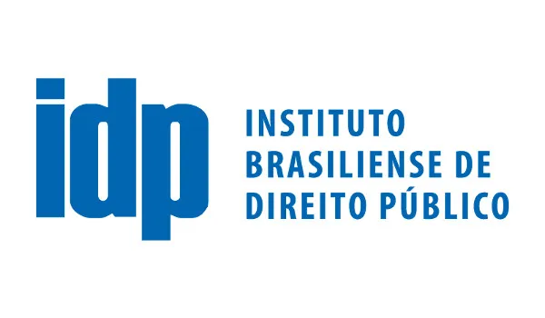
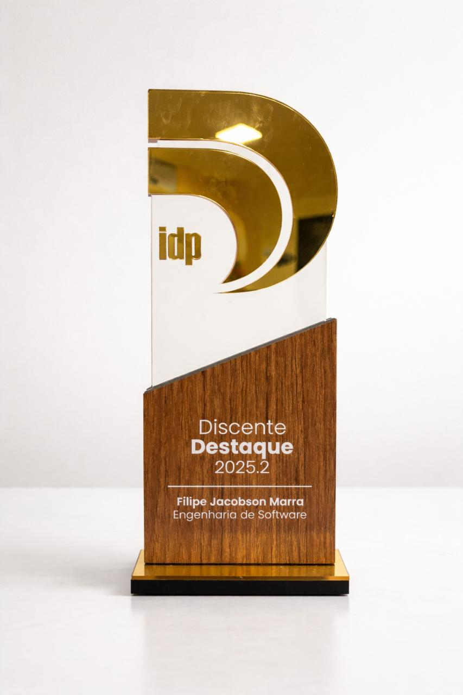
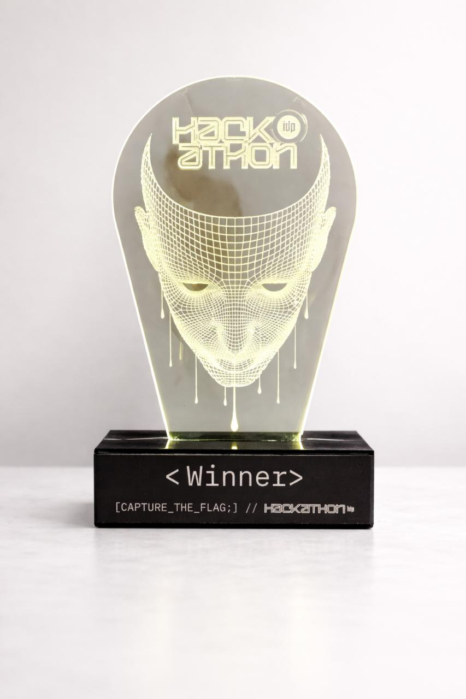

# Instituto Brasileiro de Ensino, Desenvolvimento e Pesquisa (IDP)

## Sobre o Repositório

Este repositório reúne as atividades, tarefas, provas e projetos realizados durante minha graduação em Engenharia de Software no Instituto Brasileiro de Ensino, Desenvolvimento e Pesquisa (IDP).

- **Discente:** Filipe Jacobson Marra
- **Curso:** Engenharia de Software
- **Faculdade:** Instituto Brasileiro de Ensino, Desenvolvimento e Pesquisa (IDP)

## Estrutura

O repositório está organizado por semestres, contendo materiais de cada disciplina, exercícios, avaliações e projetos desenvolvidos ao longo do curso.

- SEMESTRE 01
- SEMESTRE 02
- SEMESTRE 03
- SEMESTRE 04
- SEMESTRE 05
- SEMESTRE 06
- SEMESTRE 07
- SEMESTRE 08

## Reconhecimento Acadêmico

**Discente Destaque — IDP | Engenharia de Software (2025.2)**

Reconhecimento concedido pelo Instituto Brasileiro de Ensino, Desenvolvimento e Pesquisa (IDP) pelo desempenho acadêmico de destaque no curso de Engenharia de Software no semestre 2025.2.

A premiação destaca estudantes que demonstraram excelência acadêmica, dedicação e impacto ao longo do semestre.

---

## Premiações e Conquistas

### 🏆 Primeiro Lugar – Hackathon CTF (Jeopardy)

Concedido por IDP · nov de 2024

Conquistei o 1º lugar no Hackathon CTF (Capture The Flag – formato Jeopardy) promovido pelo IDP, enfrentando uma maratona intensa de desafios técnicos em cibersegurança.

A competição incluiu desafios de segurança web, exploração de binários (PWN), engenharia reversa, computação forense, criptografia, esteganografia e OSINT, exigindo raciocínio lógico, criatividade e colaboração em equipe.

A experiência proporcionou um grande crescimento técnico e reforçou meu interesse na área de segurança da informação e resolução de problemas complexos.

---

## Certificados Conquistados

Durante minha graduação, conquistei diversos certificados em eventos, cursos, competições e atividades promovidas pelo IDP:

- 3ª Edição do Hackathon IDP
- 4ª IDP Hackathon 2.24
- 5ª Edição do Hackathon IDP
- Mini Curso de React e React Native
- Certificado Pre Save
- Certificados SPRINT IDP
- Job Fair 2025
- Missão IDP

Os certificados estão disponíveis na pasta [`assets/certificados`](./assets/certificados).

---

> Este repositório reflete minha trajetória acadêmica, dedicação e evolução como estudante de Engenharia de Software no IDP.
